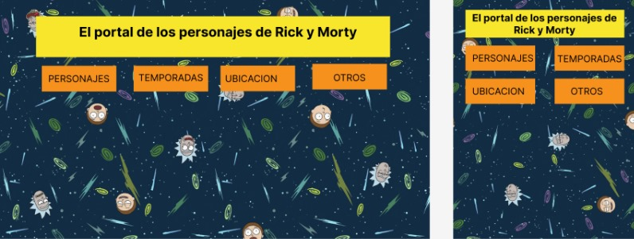

# Data Lovers

# Rick and Morty Character Portal

* [1. Descripción](#descripción)
* [2. Proceso de Diseño](#proceso-de-diseño)
* [3. Prototipo](#Prototipo)
* [4. Instalación y Uso](#Instalación-y-Uso)

***

## Descripción
Data Lovers es un portal de personajes de Rick and Morty que te permite explorar y conocer más sobre los personajes de esta popular serie de televisión. Puedes buscar personajes por nombre, ordenarlos alfabéticamente, filtrarlos por categoría y obtener tarjetas de personajes de forma aleatoria. Este proyecto está diseñado para los amantes de Rick and Morty que deseen obtener información detallada sobre los personajes de la serie.

## Proceso de Diseño
### Investigación de Usuarios
La investigacion se enfoco en los fanáticos de Rick and Morty, para asi brindarles una herramienta que les permitiera explorar fácilmente información sobre los personajes de la serie donde identifico las siguientes necesidades de los usuarios:

* ### La capacidad de buscar personajes por nombre.
    * La opción de filtrar todos los personajes principales (
    "Rick", "Morty", "Summer", "Beth" y "Jerry") asi tambien se tiene la posibilidad de observar todos los personajes.
    * La posibilidad de ordenar los personajes alfabéticamente ("A - Z" & "Z - A").
    * Se integro una opcion de busqueda por nombre.
    * La posibilidad de obtener tarjetas de personajes de forma aleatoria.

* ### Historias de Usuario
    * #### Búsqueda de Personajes
    El usuario puede ingresar un nombre en el campo de búsqueda y ver los personajes que coinciden con ese nombre.
    #### Criterios de Aceptación:
    El campo de búsqueda permite al usuario ingresar un nombre.Los personajes que coinciden con el nombre ingresado se muestran en pantalla.
    * #### Ordenar Personajes Alfabéticamente
    El usuario puede seleccionar una opción de ordenamiento y ver los personajes ordenados en consecuencia.
    #### Criterios de Aceptación:
    Se proporciona una opción de ordenamiento alfabético. Los personajes se reorganizan cuando se selecciona una opción de ordenamiento.
    * #### Filtrar Personajes por Categoría
    Definición de Terminado: El usuario puede seleccionar una categoría y ver solo los personajes que pertenecen a esa categoría.
    #### Criterios de Aceptación:
    Se proporciona una categoría para elegir. Los personajes se filtran según la categoría seleccionada.
    * #### Obtener una Tarjeta Aleatoria
     El usuario puede hacer clic en un botón para obtener una tarjeta aleatoria de personaje de Rick and Morty.
    #### Criterios de Aceptación:
    Se proporciona un botón que permite al usuario obtener una tarjeta aleatoria. Al hacer clic en el botón, se muestra una tarjeta de personaje de forma aleatoria.

***
## Prototipo
En el repositorio, puedes encontrar fotos de los bocetos y prototipos de baja fidelidad utilizados durante el proceso de diseño. Estos bocetos ayudaron a definir la estructura y la apariencia de la página web.
* ### Baja calidad

* ### Alta calidad

***
## Instalación y Uso

Para utilizar Rick and Morty Character Portal, sigue estos pasos:

Para acceder no necesitas descargar algun archivo solo tienes que ingresar en tu navegador web de tu preferencia y dirigete a el [enlace la de pagina](https://warakaren.github.io/WKdata-lovers/src/),
Utiliza las opciones de búsqueda, ordenamiento por alfabeto, filtrado por personaje y el botón de para obtener una tarjeta aleatoria para explorar los personajes de Rick and Morty.